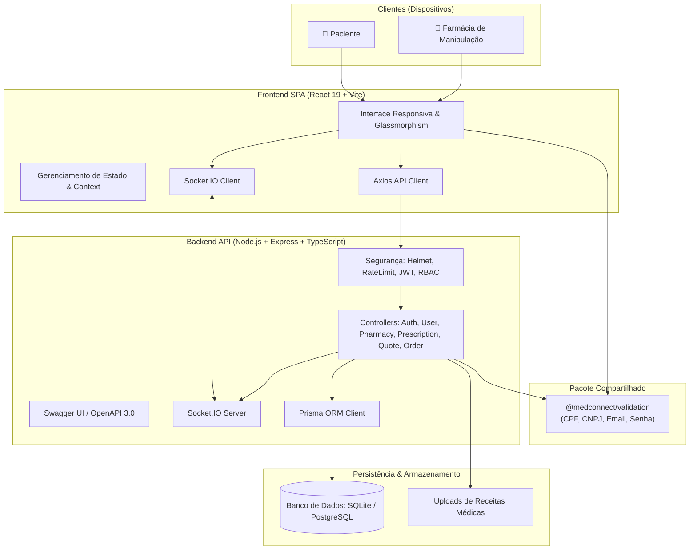
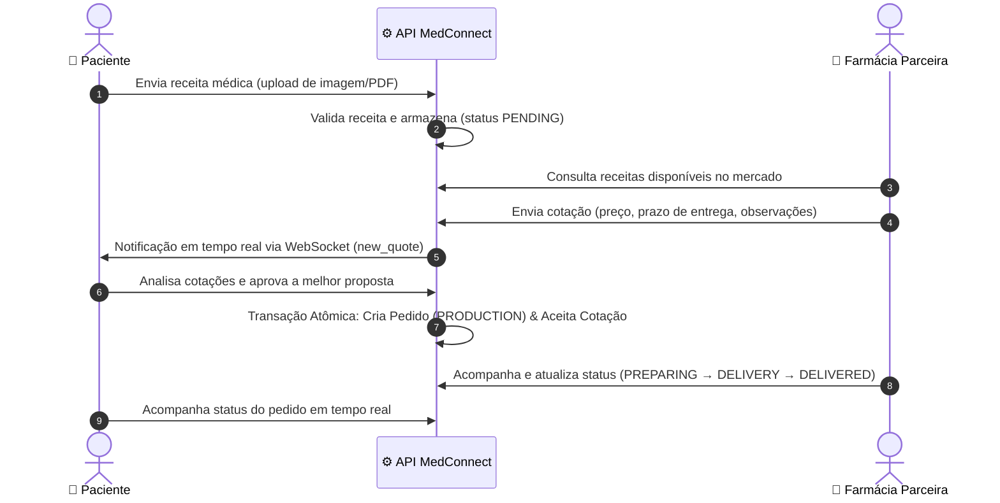

# 💊 MedConnect Application

> Plataforma completa e moderna para cotação, manipulação e acompanhamento de medicamentos entre pacientes e farmácias — desenvolvida com **Monorepo**, **TDD**, **OpenAPI/Swagger**, **CI/CD** e padrões de segurança de alto nível.


---

## 🚀 Destaques da Solução

- **Monorepo com NPM Workspaces**: Orquestração unificada de frontend SPA, API backend e pacote de validação compartilhado.
- **Validação Matemática Rigorosa (TDD)**: Pacote `@medconnect/validation` com cálculo oficial de dígitos verificadores para **CPF** e **CNPJ**, validação de e-mail e regras de força de senha.
- **Transações Atômicas**: Garantia de integridade relacional via `prisma.$transaction` ao aprovar orçamentos e gerar pedidos de produção.
- **Segurança Reforçada**: Autenticação JWT, autorização granular por papéis (`PATIENT`, `PHARMACY`, `ADMIN`), mitigação de vulnerabilidades IDOR, Rate Limiting e Helmet HTTP headers.
- **Notificações em Tempo Real**: WebSocket via Socket.IO para alertas imediatos ao paciente sobre novas cotações.
- **Documentação Viva (OpenAPI 3.0)**: Swagger UI interativo disponível em `/api-docs`.

---

## 🏛️ Arquitetura do Sistema



---

## 🔄 Fluxo de Negócio (Jornada da Cotação ao Pedido)



---

## 📁 Estrutura do Monorepo

```
MedConnect_Application/
│
├── .github/
│   └── workflows/
│       ├── ci.yml                  # Pipeline CI paralelo (Frontend + Backend)
│       └── deploy-pages.yml        # Deploy contínuo do frontend no GitHub Pages
│
├── MedConnect/                     # Aplicação SPA Frontend (React 19, Vite, Tailwind/CSS)
│   ├── src/
│   │   ├── components/             # Header, BottomNav, Modais, Cards
│   │   ├── pages/
│   │   │   ├── user/               # Home, NewQuote, QuoteOffers, Orders
│   │   │   └── pharmacy/           # Dashboard, Requests, SendQuote, OrderManagement
│   │   ├── services/api.js         # Cliente HTTP configurado com interceptors
│   │   └── utils/                  # Utilitários e testes legados
│   └── package.json
│
├── backend/                        # API RESTful (Express, TypeScript, Prisma, Socket.IO)
│   ├── src/
│   │   ├── controllers/            # Lógica de controle com checagens IDOR e RBAC
│   │   ├── docs/swagger.yaml       # Especificação completa OpenAPI 3.0
│   │   ├── middlewares/            # Autenticação JWT e RBAC
│   │   └── routes/                 # Definição de rotas REST
│   ├── prisma/
│   │   └── schema.prisma           # Modelagem relacional e enum de status
│   ├── tests/                      # Testes automatizados com Supertest e Jest
│   └── package.json
│
├── packages/
│   └── validation/                 # @medconnect/validation compartilhado (ESM + CJS + Types)
│
├── legacy/                         # Protótipo estático original arquivado
│   ├── index.html
│   └── README.md
│
├── docs/
│   └── decisoes/                   # Architectural Decision Records (ADRs)
│       ├── 001-monorepo-workspaces.md
│       ├── 002-arquitetura-backend-prisma.md
│       └── 003-validacao-compartilhada-e-seguranca.md
│
├── .editorconfig                   # Padronização de formatação de código
├── package.json                    # Raiz do Monorepo (NPM Workspaces)
└── README.md
```

---

## 📖 Decisões Arquiteturais (ADRs)

Todas as principais escolhas técnicas estão documentadas formalmente em [`docs/decisoes/`](./docs/decisoes/):
- **[ADR 001: Adoção de Monorepo com NPM Workspaces](./docs/decisoes/001-monorepo-workspaces.md)**
- **[ADR 002: Arquitetura Backend com Node.js, TypeScript e Prisma ORM](./docs/decisoes/002-arquitetura-backend-prisma.md)**
- **[ADR 003: Validação Compartilhada com TDD e Modelo de Segurança RBAC / IDOR](./docs/decisoes/003-validacao-compartilhada-e-seguranca.md)**

---

## 🧪 Testes Automatizados

O ecossistema possui **39 testes automatizados** passando em paralelo:
- **Frontend / Utilitários**: 29 testes unitários (validações, refatoração de código).
- **Backend / API**: 10 testes de integração (rotas de usuários, documentação Swagger, validação de regras de negócio e controle de acesso RBAC).

```bash
# Executa todos os testes em paralelo no Monorepo
npm run test

# Executa testes isolados por workspace
npm run test:frontend
npm run test:backend
```

---

## ▶️ Como Executar Localmente

### Pré-requisitos
- **Node.js** v20 ou superior
- **NPM** v10 ou superior

### Passo a Passo

1. **Clone o repositório:**
   ```bash
   git clone https://github.com/alexsander020/MedConnect_Application.git
   cd MedConnect_Application
   ```

2. **Instale todas as dependências do Monorepo:**
   ```bash
   npm install --legacy-peer-deps
   ```

3. **Configure as variáveis de ambiente:**
   - No backend: copie `backend/.env.example` para `backend/.env`
   ```bash
   cp backend/.env.example backend/.env
   ```

4. **Inicie o Frontend e o Backend simultaneamente:**
   ```bash
   npm run dev
   ```

5. **Acesse as aplicações:**
   - **Frontend (SPA):** [http://localhost:5173](http://localhost:5173)
   - **API Backend:** [http://localhost:3000](http://localhost:3000)
   - **Documentação Swagger UI:** [http://localhost:3000/api-docs](http://localhost:3000/api-docs)

---

## 👤 Autor

**Alexsander Sudario Abreu**
Estudante de Ciência da Computação — FECAP, São Paulo

[](https://www.linkedin.com/in/alexsander-sudario-0a793524a/)
[](https://github.com/alexsander020)
